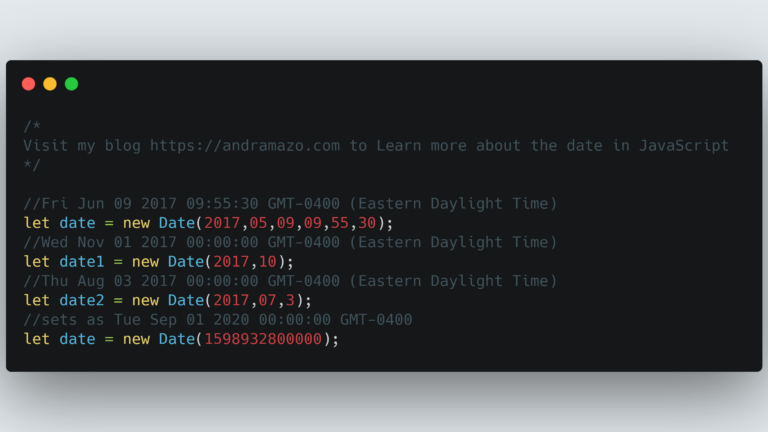
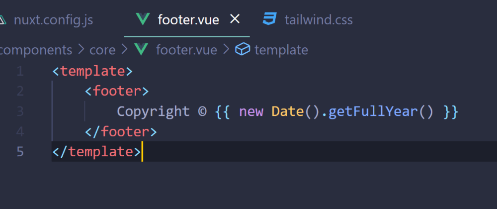
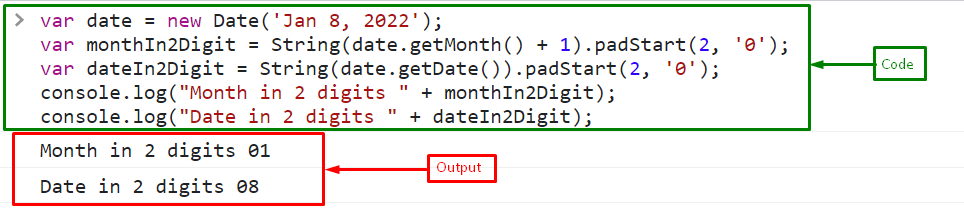
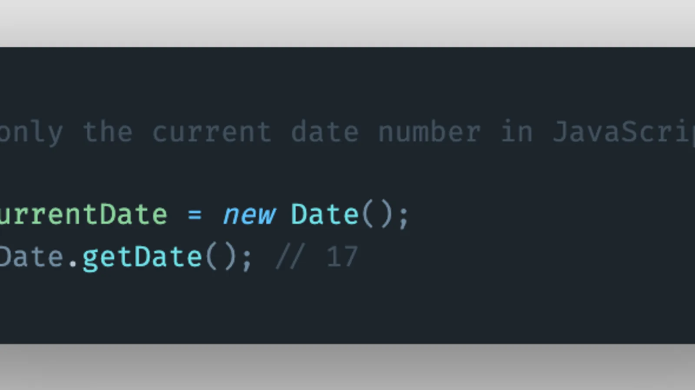

# __Что такое new Date()__ 
*New Date( )* - это констриктор который позволяет возвращять, измениять и настраевать время по своему жеданию. Для создания даты существует несколько путей:
* *New Date( )* - то есть просто высвать эту команду и она покажет сегоднишнию дату и время.

- *New Date( milliseconds )* - как и говорится в названии здесь используются милисекунды, дату оно насчитывает с 1970 годы и прибовляет нужное вам количество милисекунд.

- *New Date( Date string )* - как понятно с названия тут нужно написать дату в виде текста.

- *New Date( year, month, day, hours, minutes, seconds, milliseconds )* - как мы уже видим здесть через запятые идёт вся информация о дате начина с года заканчивая милисекундой.
----------------------------------------------------------------

# __New Date() metod now()__ 
Метод *now()* показывает настоящее время, то есть полную дату и время настоящего времени.

# __New Date() metod getFullYear()__ 
Это метод выводит дату настоящего времени или заданого пользователем в *New Date()*.

----------------------------------

# __New Date() metod getMonth()__ 
Это метод каторый выводить настоящий месяц в его поочерёдном индексе, то есть если сейчас февраль то он выведет цифру 1 потому что отчёт индексов начинается с 0 и заканчивается 11-ю поэтому второй месяц покажется первым.

# __New Date() metod getDate()__ 
Этот метод показывает сегоднишний день.

------------------------------------------------------

# __New Date() metod getDay()__ 
Этот метод работает как метод *getMonth()*, но воспроизводить день нидели, но его индекс. Также подсчёт нидель начинается с воскресенья и заканчивается понедельником.

# __New Date() metod getHours()__ 
Это метод который воспроизводить сейчасний час времени.

# __New Date() metod getMinutes()__ 
*GetMinutes()* мотод который воспроизводит минуту настоящего времени.

# __New Date() metod setDate()__ 
Это метод который помогает измениять время, но он может изменить только день.

------------------------------------------------------

# __New Date() metod setMonth()__
*SetMonth()* метод который может изменить настоящий месяц или указанный в *New Date()*.

# __New Date() metod setFullYear()__ 
Он может изменить настоящий или отредактированный год.

-------------------------------------------------
